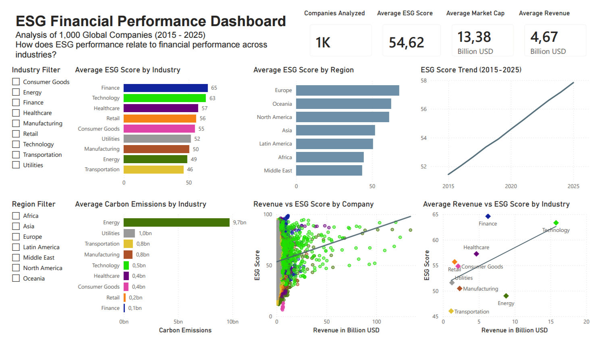
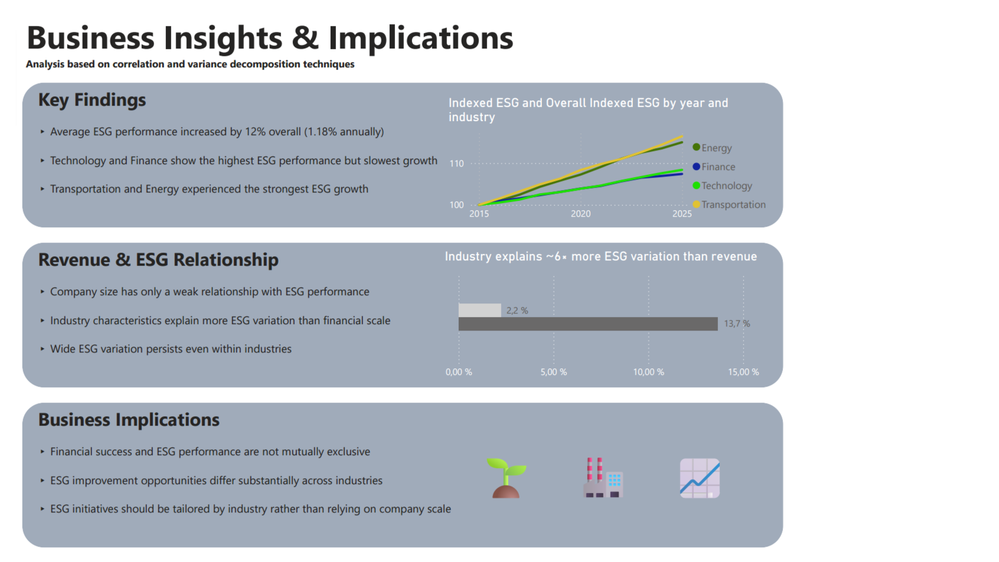

# ESG Financial Performance Analysis

## Project Overview

This project analyzes synthetic ESG and financial performance data for **1,000 global companies** across **9 industries**, **7 regions**, and the period **2015–2025**.

The goal of the project is to explore how ESG performance differs across industries and regions, how ESG scores evolved over time, and whether financial scale is meaningfully related to sustainability performance.

The project combines **Python**, **SQL**, **PostgreSQL**, and **Power BI** to create a complete end-to-end data analysis workflow from data exploration to business dashboarding.

## Business Questions

The analysis focuses on the following questions:

* Which industries achieve the strongest ESG performance?
* How has ESG performance developed between 2015 and 2025?
* Which sectors have the highest carbon emissions?
* How does ESG performance differ across regions?
* Is revenue meaningfully related to ESG performance?
* Do industry characteristics explain ESG variation more strongly than revenue level?

## Tools Used

* **Python**: data cleaning, exploratory data analysis, statistical analysis
* **Pandas**: data manipulation and aggregation
* **Matplotlib / Seaborn**: data visualization
* **PostgreSQL / SQL**: data validation and analytical queries
* **Power BI**: interactive dashboard development
* **DAX**: calculated business metrics and dashboard measures
* **GitHub**: project documentation and version control

## Dataset

The dataset contains synthetic company-level ESG and financial data.

Key dimensions include:

* **1,000 companies**
* **11,000 annual observations**
* **9 industries**
* **7 geographic regions**
* **2015–2025 reporting period**

Main variables include:

* Revenue
* Profit margin
* Market capitalization
* ESG overall score
* ESG environmental score
* ESG social score
* ESG governance score
* Carbon emissions
* Water usage
* Energy consumption

Because the dataset is synthetic, the results should be interpreted as an analytical demonstration rather than as real-world investment or sustainability advice.

## Methodology

The project follows a structured data analysis workflow:

1. **Operational setup**
   Required libraries are imported, the dataset is loaded, and derived variables such as ESG growth are created.

2. **Exploratory data analysis**
   ESG performance is analyzed across industries, regions, time, financial metrics, and top-performing companies.

3. **SQL validation**
   SQL queries are used to validate data quality and reproduce key analytical results.

4. **Statistical analysis**
   Revenue–ESG correlation and ESG variance decomposition are used to quantify selected relationships.

5. **Power BI dashboarding**
   Key insights are translated into an interactive business dashboard for executive-level exploration.

## Key Findings

* **ESG performance varies substantially across industries.** Finance and Technology achieved the highest average ESG scores, while Transportation and Energy ranked lower in absolute ESG performance.

* **ESG improvement and ESG performance are not the same.** Transportation and Energy recorded the strongest relative ESG improvement over time, despite lower overall ESG scores.

* **Environmental impact remains highly industry-dependent.** Energy companies exhibited substantially higher carbon emissions than all other sectors.

* **ESG performance improved steadily over time.** Average ESG scores increased throughout the 2015–2025 period.

* **Regional differences are clearly visible.** Europe achieved the highest average ESG performance in the dataset.

* **Revenue is only weakly related to ESG performance.** The Revenue–ESG correlation was weakly positive at approximately **0.15**.

* **Industry characteristics explain more ESG variation than revenue level.** Industry explained approximately **13.7%** of ESG variation, compared with **2.2%** explained by revenue.

## Dashboard Preview

The Power BI dashboard summarizes the key ESG and financial performance insights across two pages.

### Executive ESG Overview



### Business Insights & Implications



## Repository Structure

```text
ESG-Financial-Analytics/
│
├── data/
│   └── company_esg_financial_dataset.csv
│
├── notebooks/
│   └── 01_data_exploration.ipynb
│
├── sql/
│   ├── 01_data_quality_checks.sql
│   ├── 02_esg_industry_analysis.sql
│   ├── 03_esg_financial_analysis.sql
│   └── 04_top_company_analysis.sql
│
├── dashboard/
│   ├── ESG_Financial_Performance_Dashboard.pbix
│   └── ESG_Financial_Performance_Dashboard.pdf
│
├── images/
│   ├── dashboard_overview.png
│   └── business_insights.png
│
└── README.md
```

## Project Files

* **Notebook:** `notebooks/01_data_exploration.ipynb`
  Contains the full Python-based exploratory and statistical analysis.

* **SQL Queries:** `sql/`
  Contains PostgreSQL queries for data quality checks, industry analysis, financial analysis, and top company rankings.

* **Dashboard:** `dashboard/`
  Contains the Power BI dashboard file and exported dashboard PDF.

* **Images:** `images/`
  Contains dashboard screenshots used in the README.

## How to Run

1. Clone or download the repository.
2. Open the notebook in Jupyter Notebook, JupyterLab, or VS Code.
3. Install the required Python libraries if needed:

```bash
pip install pandas matplotlib seaborn
```

4. Run the notebook from top to bottom.

The notebook expects the dataset to be stored at:

```text
data/company_esg_financial_dataset.csv
```

If the notebook is run from inside the `notebooks/` folder, the relative path used is:

```text
../data/company_esg_financial_dataset.csv
```

## Limitations

* The dataset is synthetic and does not represent real companies.
* ESG scores are treated as comparable across industries, although real-world ESG rating methodologies often differ between providers.
* The analysis identifies statistical relationships but does not establish causality.
* Revenue is used as a proxy for financial scale, but company size can also be measured through other indicators such as employees, assets, or enterprise value.
* The Power BI dashboard is provided as a project artifact and is not hosted as an interactive online dashboard.

## Future Improvements

Potential future extensions include:

* Adding real-world ESG rating data from multiple providers
* Comparing ESG rating disagreement across agencies
* Extending the analysis with regression models
* Adding sector-specific ESG benchmarks
* Publishing the Power BI dashboard through an interactive online service

## Author

Created by **FreddyData** as a data analytics portfolio project.
